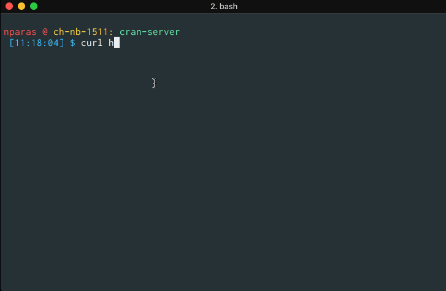

# cran-server


 > This repository has been [archived](https://help.github.com/en/github/creating-cloning-and-archiving-repositories/archiving-repositories).  This means it is **no longer actively maintained (no further PRs or issues will be considered)** but remains read-only for all users. See issue #77 for details on why this is archived.  Contact [opensource@uptake.com](mailto:opensource@uptake.com) if need be. 

A self hosted CRAN-like R package repository.



- [Quick Start](#quick-start)
- [Features](#features)
- [Installation](#installation)
- [Usage](#usage)
- [Configuration](#configuration)

## Quick Start

1. Build the docker image

```
git clone https://github.com/UptakeOpenSource/cran-server
cd cran-server
docker build -t cran-server .
```

2. Run the docker image

```
docker run --name cran --rm -d -p 8080:80 cran-server
```

3. Visit in your browser

```
# On Mac
open http://localhost:8080
```
You're all set!


## Features

- **Ready**: supports AWS S3 and file system storage out of the box
- **Extensible**: we made it really easy to support other storage backends
- **Web UI**: allows you to see and search published packages


## Installation

**cran-server** requires Python 3.5 or greater.

### From source

```
git clone https://github.com/UptakeOpenSource/cran-server
cd cran-server
pip install .
```


## Usage

### Posting packages to **cran-server**

You can release a package to `cran-server` using a POST request.

```
# bash
tarball=<PATH-TO-TARBALL>
curl -X POST -F file=@$tarball http://localhost:8080
```

### Installing packages from **cran-server** from R

Use the `repos` argument when using `install.packages` from R. For example, when running locally:

```
install.packages('uptasticsearch', repos = 'http://localhost:8080')
```


## Configuration

### Package storage

By default, `cran-server` uses file system storage, but in a production environment in most cases S3 or another object store is desirable. `cran-server` supports AWS S3 out of the box. The recommended way to set configuration options is using a `.env` file.

```
# .env
STORAGE_BACKEND='aws'
AWS_ACCESS_KEY_ID=<YOUR_AWS_ACCESS_KEY_ID_HERE>
AWS_SECRET_ACCESS_KEY=<YOUR_AWS_SECRET_ACCESS_KEY_HERE>
AWS_DEFAULT_REGION=<YOUR_PREFERED_REGION_HERE>
AWS_DEFAULT_BUCKET=<YOUR_PREFERRED_DEFAULT_BUCKET_HERE>
```

The environment file can then be sourced when running from docker:

```
docker run --name cran --rm -d -p 8080:80 --env-file=.env cran-server
```
